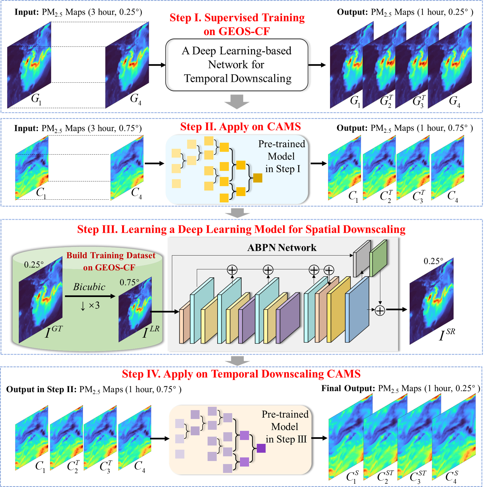
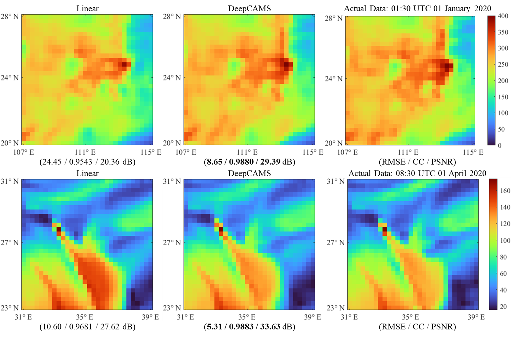
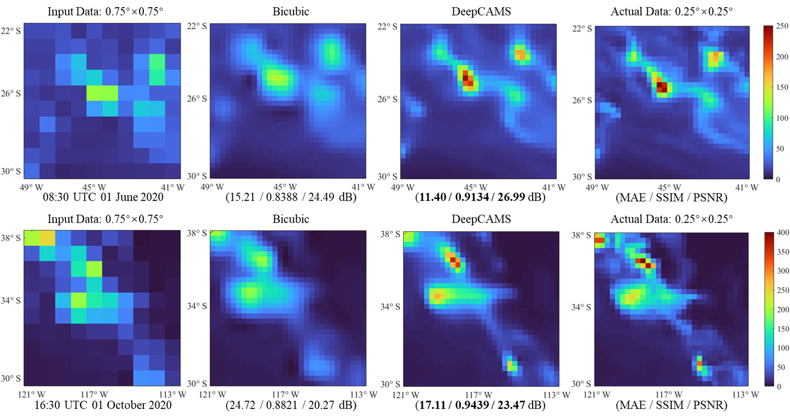
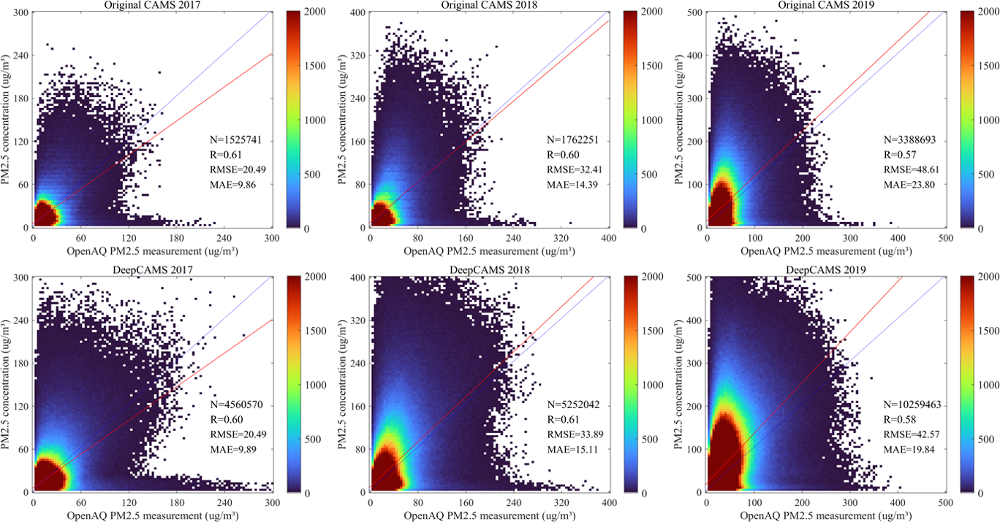

# DeepCAMS (STOTEN 2022)
### 📖[**Paper**](https://www.sciencedirect.com/science/article/pii/S1566253523001100) | 🖼️[**PDF**](/img/DeepCAMS.pdf)

PyTorch and MATLAB codes for "[Generating long-term (2003-2020) hourly 0.25° global PM2.5 dataset via spatiotemporal downscaling of CAMS with deep learning (DeepCAMS)](https://www.sciencedirect.com/science/article/pii/S004896972204846X)", **Science of The Total Environment (STOTEN)**, 2022.

Authors: [Yi Xiao](https://xy-boy.github.io/), Yuan Wang, [Qiangqiang Yuan*](http://qqyuan.users.sgg.whu.edu.cn/), [Jiang He](https://jianghe96.github.io/), and [Liangpei Zhang](http://www.lmars.whu.edu.cn/prof_web/zhangliangpei/rs/index.html)<br>
Wuhan University

### Abstract
>Generating a long-term high-spatiotemporal resolution global PM2.5 dataset is of great significance for environmental management to mitigate the air pollution concerns worldwide. However, the current long-term (2003–2020) global reanalysis dataset Copernicus Atmosphere Monitoring Service (CAMS) reanalysis has drawbacks in fine-scale research due to its coarse spatiotemporal resolution (0.75°, 3-h). Hence, this paper developed a deep learning-based framework (DeepCAMS) to downscale CAMS PM2.5 product on the spatiotemporal dimension for resolution enhancement. The nonlinear statistical downscaling from low-resolution (LR) to high-resolution (HR) data can be learned from the high-quality (0.25°, hourly) but short-term (2018–2020) Goddard Earth Observing System composition forecast (GEOS-CF) system PM2.5 product. Compared to the conventional spatiotemporal interpolation methods, simulation validations on GEOS-CF demonstrate that DeepCAMS is capable of producing accurate temporal variations with an improvement of Root-Mean-Squared Error (RMSE) of 0.84 (4.46 to 5.30) ug/m3 and spatial details with an improvement of Mean Absolute Error (MAE) of 0.16 (0.34 to 0.50) ug/m3. The real validations on CAMS reflect convincing spatial consistency and temporal continuity at both regional and global scales. Furthermore, the proposed dataset is validated with OpenAQ air quality data from 2017 to 2019, and the in-situ validations illustrate that the DeepCAMS maintains the consistent precision (R: 0.597) as the original CAMS (R: 0.593) while tripling the spatiotemporal resolution.
>
### 🌱2003-2020 Global Hourly 0.25° PM2.5 Dadaset🌱
Please download from Zenodo: <a href="https://doi.org/10.5281/zenodo.6967082"></a>
 
### The overall two-stage flowchart

 
 ## Environment
 > - CUDA 10.0
> - pytorch 1.x
 
 ## Model Training
 ### 1) For spatial downscaling
 Download the LR-HR paired Geos-CF from [Google Drive](https://drive.google.com/drive/folders/1DjccGiyZHeBrivw-Xg-FN8MW3noOrGhF?usp=sharing)
 ### 2) For temporal downscaling
 Download the hourly Geos-CF from [Google Drive](https://drive.google.com/drive/folders/1Wr13Q_eQSkRCYZj8741pJ49A655QRQDd?usp=sharing)
 ### 3) Two-Stage Training
```
python /T-SR/my_train.py
python /S-SR/main_3x.py
```

## Test
```
python T-SR/test.py
python S-SR/demo_3x.py
```
### Temporal downscaling results

 
 ### Spatial Downscaling results

 
 ### In-situ Validation

 
 #### More details can be found in our paper!

## Contact
If you have any questions or suggestions, feel free to contact me. 😊  
Email: xiao_yi@whu.edu.cn; xy574475@gmail.com

## Citation
If you find our work helpful in your research, please consider citing it. Many thanks for your support! 😊 
```
@article{xiao2022deepcams,
  title={Generating a long-term (2003- 2020) hourly 0.25° global PM2.5 dataset via spatiotemporal downscaling of CAMS with deep learning (DeepCAMS)},
  author={Xiao, Yi and Wang, Yuan and Yuan, Qiangqiang and He, Jiang and Zhang, Liangpei},
  journal={Science of The Total Environment},
  volume={848},
  pages={157747},
  year={2022},
  publisher={Elsevier}
}
```

## Acknowledgement
Our work is built upon [XVFI](https://github.com/JihyongOh/XVFI) and [ABPN](https://github.com/Holmes-Alan/ABPN).  
Thanks to the author for these awesome works!
